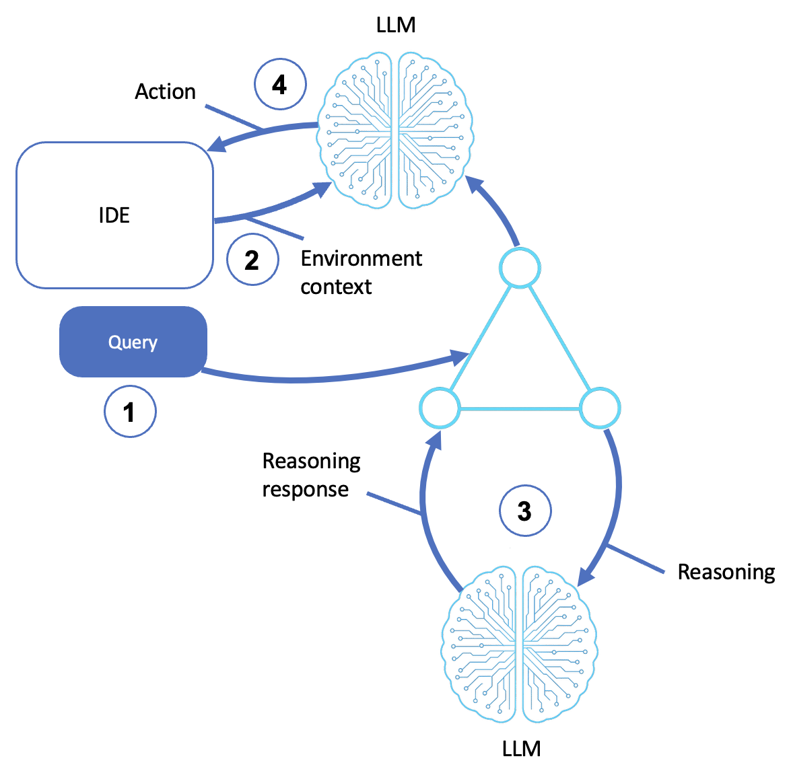

# Coding Agents

Agents that reason about programming tasks rather than just autocompleting code. A coding agent interprets your goal, gathers context, and performs multi-step changes.

This sample builds coding agents with the [Strands Agents SDK](https://strandsagents.com/) and is based off of the [AWS Prescriptive Guidance - Coding agents pattern](https://docs.aws.amazon.com/prescriptive-guidance/latest/agentic-ai-patterns/coding-agents.html).

## Table of Contents

- [Quick Start](#quick-start)
- [Single-Purpose Coding Agents](#single-purpose-coding-agents)
  - [How It Works](#how-it-works)
  - [Code Generator](#code-generator)
  - [Code Reviewer](#code-reviewer)
  - [Refactoring Agent](#refactoring-agent)
  - [Test Generator](#test-generator)
- [Interactive Coding Assistant](#interactive-coding-assistant)
- [AWS Implementation Patterns](#aws-implementation-patterns)
- [Reference](#reference)

## Quick Start

**Prerequisites:**
- Python 3.10+
- An AWS account with Amazon Bedrock access
- AWS credentials configured (`aws configure`) with permission to invoke models on Bedrock

```bash
# Create and activate virtual environment
python3 -m venv venv
source venv/bin/activate  # On Windows: venv\Scripts\activate

# Install dependencies
pip install -r requirements.txt

# Point the sample at your AWS profile and region (loaded by shared/model.py)
cp .env.example .env
# Edit .env: set AWS_PROFILE and AWS_REGION. Optionally pin a model with STRANDS_MODEL_ID.

> Note: only run the following scripts against one example at a time. Just pointing to the entire directory may cause the agent to fail due to limitations placed on max_tokens. You can edit this parameter to increase the agents call and response capabilities

# Run any of the coding agents
python code_generator.py     # generate code from a description
python code_reviewer.py      # review code for bugs and security
python refactor_agent.py     # improve code, preserve behavior
python test_generator.py     # generate pytest cases
python coding_assistant.py   # all of the above + file read/write tools
```

**Try these exercises:**
1. **Generate, then test.** Have `code_generator.py` write a function and save it in the "generated code" folder. Have the `test_generator.py` generate tests and review these tests.
2. **Catch the bugs.** Type `example` in `code_reviewer.py` and see what it flags (the sample has a SQL-injection and a divide-by-zero).
3. **Tighten the prompt.** Give `refactor_agent.py` a specific goal (e.g., "add type hints only") and compare against an open-ended "refactor this."
4. **Use file tools.** With `coding_assistant.py`, ask it to read an existing `.py` file and suggest improvements.

---

## Single-Purpose Coding Agents

Four of the agents in this sample each do one coding task well. They share the same structure and differ only in what that prompt steers the model to do. None of them need tools: they reason over the code you paste in.

Three of them (the reviewer, refactorer, and test generator) also accept the keyword `example` to run against a built-in sample. The samples live in [`examples/`](examples/) so you can edit them without touching the agent code.

### How It Works

1. **Receives query**: the user gives natural-language instructions through a chat window or CLI (for example, "Add logging to this function" or "Refactor for readability")
2. **Extracts environment context**: the agent gathers context, error messages, test results, and other agents' output
3. **LLM reasoning**: the agent sends the query and context to an LLM, which reasons about what needs to change, how to generate a solution, and what refactoring or coding steps to take
4. **Executes actions**: the LLM returns output that the agent applies to the environment. For example: inserting or modifying code, generating docs, or triggering build, test, and linting tasks



### Code Generator

The [code generator](code_generator.py) writes code from a natural-language description. The system prompt steers it to clarify requirements, choose appropriate structures, document the code, and explain its approach before the snippet:

```python
agent = Agent(system_prompt=CODE_GEN_PROMPT, callback_handler=None)
response = agent("Write a function that finds all prime numbers up to n")
```

### Code Reviewer

The [code reviewer](code_reviewer.py) analyzes code for bugs, security vulnerabilities, performance, and style, returning structured feedback (Critical Issues / Improvements / Style). Type `example` to review a built-in snippet that intentionally contains a SQL-injection and a divide-by-zero.

### Refactoring Agent

The [refactoring agent](refactor_agent.py) improves existing code while **preserving its behavior**. Its prompt explicitly orders it to keep functionality identical and explain every change. Type `example` to refactor a deliberately messy sample.

### Test Generator

The [test generator](test_generator.py) writes pytest cases for code you give it, covering the happy path, edge cases, and error conditions. Including docstrings in your input helps it infer expected behavior. Type `example` to generate tests for two sample functions.

---

## Interactive Coding Assistant

The [coding assistant](coding_assistant.py) combines all of the above: generate, review, refactor, test, in one conversational agent. It also wires in optional **file tools**: with `strands-agents-tools` installed, it can `read_file` to examine existing code and `write_file` to save what it produces, so it acts on your project rather than just on pasted snippets.

```python
from strands_tools import read_file, write_file

tools = [read_file, write_file] if HAS_FILE_TOOLS else []
agent = Agent(system_prompt=ASSISTANT_PROMPT, tools=tools, callback_handler=None)
```

The agent degrades gracefully: without the tools package it still helps with pasted code, it just can't touch files.

---

## AWS Implementation Patterns

| Pattern | Description | Reference |
|---------|-------------|-----------|
| Real-time execution in code generation | Improve generation accuracy by letting Amazon Q Developer run code as it writes it | [Enhancing code generation with real-time execution in Amazon Q Developer](https://aws.amazon.com/blogs/devops/enhancing-code-generation-with-real-time-execution-in-amazon-q-developer/) |
| Specialized coding agents | Use purpose-built Amazon Q Developer agents for feature development, testing, and documentation | [Streamline development with new Amazon Q Developer agents](https://aws.amazon.com/blogs/devops/streamline-development-with-new-amazon-q-developer-agents/) |
| Guardrails for code | Apply Amazon Bedrock Guardrails to the code domain to filter unsafe or non-compliant generated code | [Amazon Bedrock Guardrails expands support for the code domain](https://aws.amazon.com/blogs/machine-learning/amazon-bedrock-guardrails-expands-support-for-code-domain/) |
| AI agent code review | Improve code-review accuracy with an AI agent built on Amazon Bedrock AgentCore | [How Baz improved its AI agent code review accuracy using Amazon Bedrock AgentCore](https://aws.amazon.com/blogs/machine-learning/how-baz-improved-its-ai-agent-code-review-accuracy-using-amazon-bedrock-agentcore/) |

## Reference

- [AWS Prescriptive Guidance - Coding agents](https://docs.aws.amazon.com/prescriptive-guidance/latest/agentic-ai-patterns/coding-agents.html)
- [Amazon Q Developer](https://aws.amazon.com/q/developer/)
- [Strands community tools package](https://strandsagents.com/docs/user-guide/sdk/tools/community-tools-package/)
- [Amazon Bedrock User Guide](https://docs.aws.amazon.com/bedrock/latest/userguide/what-is-bedrock.html)

### The series

This sample is one of eleven, one per pattern in the [AWS Prescriptive Guidance on agentic AI patterns](https://docs.aws.amazon.com/prescriptive-guidance/latest/agentic-ai-patterns/). Each has a hands-on sample repository.

| # | Pattern | Sample |
|---|---|---|
| 01 | Basic Reasoning Agents | [sample-basic-reasoning-agents](https://github.com/aws-samples/sample-basic-reasoning-agents) |
| 02 | Tool-Based Agents (Functions) | [sample-tool-based-agents-functions](https://github.com/aws-samples/sample-tool-based-agents-functions) |
| 03 | Tool-Based Agents (Servers) | [sample-tool-based-agents-servers](https://github.com/aws-samples/sample-tool-based-agents-servers) |
| 04 | Computer-Use Agents | [sample-computer-use-agents](https://github.com/aws-samples/sample-computer-use-agents) |
| 05 | Coding Agents | this repository |
| 06 | Speech and Voice Agents | [sample-speech-voice-agents](https://github.com/aws-samples/sample-speech-voice-agents) |
| 07 | Workflow Orchestration Agents | [sample-workflow-orchestration-agent](https://github.com/aws-samples/sample-workflow-orchestration-agent) |
| 08 | Memory-Augmented Agents | [sample-memory-augmented-agents](https://github.com/aws-samples/sample-memory-augmented-agents) |
| 09 | Simulation and Test-Bed Agents | [sample-simulation-testbed-agents](https://github.com/aws-samples/sample-simulation-testbed-agents) |
| 10 | Observer and Monitoring Agents | [sample-observer-monitoring-agents](https://github.com/aws-samples/sample-observer-monitoring-agents) |
| 11 | Multi-Agent Collaboration | [sample-multi-agent-collaboration](https://github.com/aws-samples/sample-multi-agent-collaboration) |

## Security

See [CONTRIBUTING](CONTRIBUTING.md#security-issue-notifications) for more information.

## License

This library is licensed under the MIT-0 License. See the LICENSE file.
